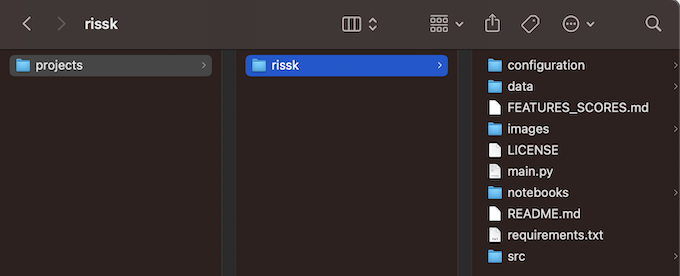
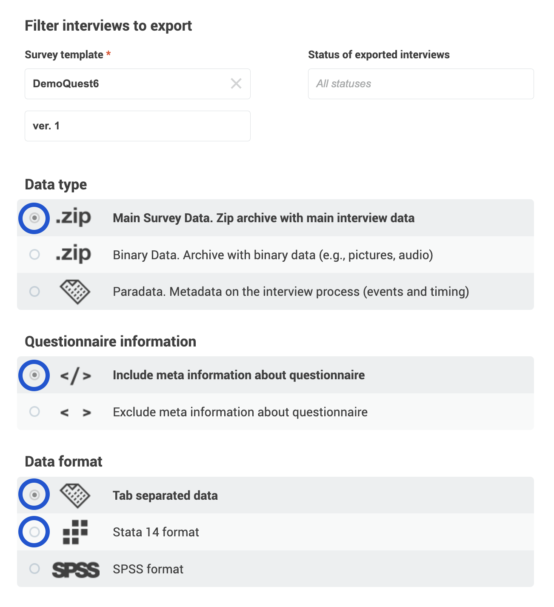
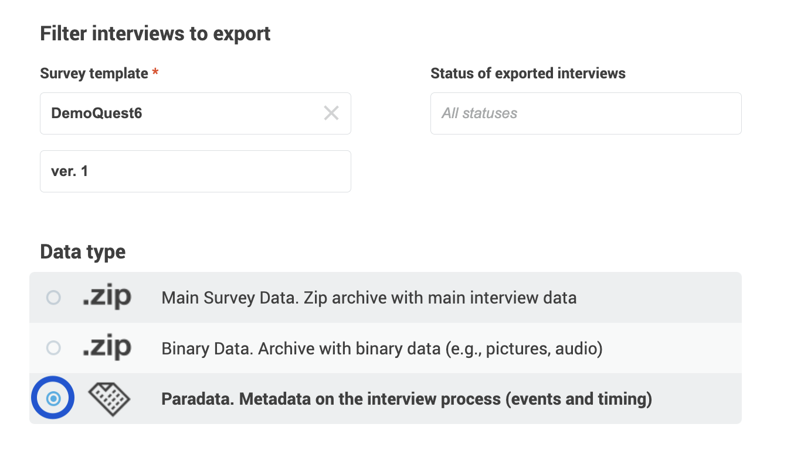
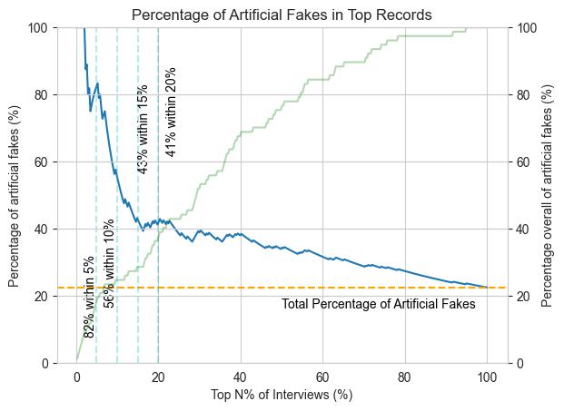
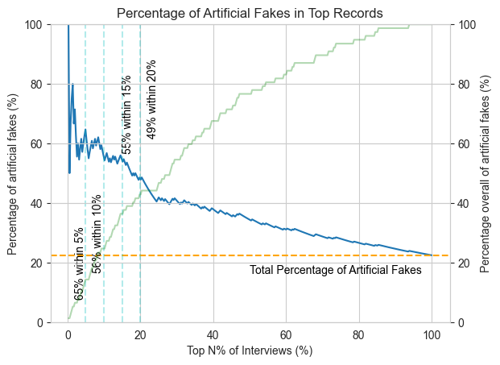

# What is RISSK?

RISSK utilizes machine learning algorithms to generate a **Unit Risk Score (URS)** from your **[Survey Solutions](https://mysurvey.solutions/en/)** export files. This score indicates the likelihood of unwanted interviewer behaviour in individual interviews. It is a valuable tool to prioritize suspicious interviews for verification exercises such as back-checking or audio audits. Designed to be generic, RISSK can be easily integrated into the monitoring systems of most CAPI or CATI surveys conducted using Survey Solutions. Setting up and running RISSK on your local machine is straightforward and platform-independent. Running locally, it ensures the privacy and security of your survey data. Explore further details in the chapters below.

- [Getting started](#getting-started)
- [Advanced use](#advanced-use)
- [Interpretation](#interpretation)
- [Survey integration](#survey-integration)
- [Limitations](#limitations)
- [Confirmation of results](#confirmation-of-results)
- [Process description](#process-description)
- [Roadmap](#roadmap)

# Getting started

These instructions will guide you on how to install and run RISSK on your local machine.

## Prerequisites

Make sure you have **Python ≥3.8 and ≤3.11** installed on your machine.  
You can verify this by running:

```shell
python --version
```
## Setup
1. **(Optional)**. RISSK creates a project folder named rissk on your local machine. You can specify where this folder should be created by navigating to the desired directory. If you skip this step, the  `rissk` directory will be created in your current working directory. To create the `rissk` folder in, for example, `users/USER/projects`, use the following command:
```
cd /Users/USER/projects
```
2. **Copy the repository**:
  - If you have a GitHub account, clone this repository onto your local machine using the following command:
```
git clone git@github.com:WorldBank/rissk.git
```
  - If you do not have a GitHub account or experience problems cloning the repository, instead [download](https://github.com/worldbank/rissk/archive/refs/heads/main.zip) the repository as a ZIP file, unzip it into your active working directory or the folder specified in Step 1, and rename the folder from `rissk-main` to `rissk`. <details><summary>Click to see a screenshot of the required folder structure.</summary></details> as is shown below. 
3. **Navigate to the project directory**: Move into the newly created `rissk` directory with:.
```
cd rissk
```
4. **Create a virtual environment**: Create a new Python virtual environment within the rissk directory to isolate the project dependencies:
```
python -m venv venv
```

> [!WARNING]
> If above line returns an error try writing `python3` instead of `python`.  

5. **Activate the virtual environment**: The activation command varies based on your operating system.

  - On **Windows**:
```
venv\Scripts\activate
```
  - On **Unix or MacOS**:
```
source venv/bin/activate
```
6. **Install dependencies**: Finally, install the project's required dependencies with:
```
pip install -r requirements.txt
```

## Setting up export folder

1. **Prepare export folder**: Create or select a folder to hold the Survey Solution export files. It can be in or outside the `rissk` directory. The absolute path to this folder will be referred to as `<export_path>` in subsequent steps. Make sure the folder is empty and does not contain any old export files.

2. **Export data from Survey Solutions**: Export and download both the Main Survey Data and Paradata. Make sure they are from the **same version** and **consecutively**, to ensure they are compatible and comparable. **Do not modify or rename** the ZIP files.
   - For the **Main Survey Data**, choose the options **Main Survey Data**, **Include meta information about questionnaire** and either **Tab separated data** or **Stata 14 format**<details><summary>Click to see a screenshot of the selected export options for Main Survey Data.</summary></details>

   - For the **Paradata**, under Data Type, select the option labelled **Paradata**. <details><summary>Click to see a screenshot of the selected export options for Paradata.</summary></details>

3. **Place export files into the export folder**: Place both ZIP files into the `<export_path>` folder. Do not modify, rename or unzip the files. The folder should contain only the Main Survey Data and Paradata export files for a single version. 
4. **Compatible versions**: If multiple versions of the **same** survey template (questionnaire) are compatible and you wish to evaluate them together, export both, the Main Survey Data and Paradata for all versions. Place the unmodified ZIP files into the `<export_path>` folder. When running the package, you will need to specify option `survey_version=all` (see Step 2 in the subsection Running the package). **Do not include** export files from different survey templates (questionnaires). 


## Running the package

1. **Navigate to RISSK directory**: If you are running the package after installation, navigate to the `rissk` directory with the following command:
```
cd /Users/USER/projects/rissk
```
2. **Execute the Package**: Run the package using the command below, replacing:
   - `<export_path>` with the **absolute** path to the folder containing your Survey Solutions export data.
   - `<output_file>` with the complete file path for the output CSV file. Note that you must specify the full path, not just the file name. If this is not provided, the results will be stored in the default file  `rissk/unit_risk_score.csv`.
```
python main.py export_path=<export_path> output_file=<output_file>
```
3. **Monitor progress**: After running the command, console logs will indicate the package's progress. Upon successful completion, the following confirmation message will appear: _'SUCCESS! you can find the unit risk score output file in ...'_.

# Advanced use

## Exporting feature score
By default, RISSK exports only the `output_file` containing the `unit_risk_score` for each interview. However, if you're interested in examining individual scores, you can achieve this by using the optional parameter `feature_score=true` when running RISSK.

```
python main.py export_path=<export_path> output_file=<output_file> feature_score=true
```

When this parameter is specified, RISSK will generate an additional CSV file alongside the main `output_file` with the suffix `_feature_score.csv`. It contains the detailed feature scores for each interview. For guidance on how to interpret each feature score, refer to [FEATURES_SCORES.md](FEATURES_SCORES.md). 


## Excluding features

By default, RISSK includes all available features when calculating the Unit Risk Score (URS). However, you may choose to exclude specific features if they unduly influence the score. This might be relevant, for example, when a particular feature significantly impacts the URS, but external verification shows that the related interviews are actually low-risk.

To exclude a feature from the URS calculation:

1. Open the configuration file `environment/main.yaml`.
2. Locate the `use:` property for the feature you wish to exclude.
3. Set its value to `false`.

For instance, to exclude the feature `answer_changed` from the URS, your configuration would look like:

```yaml
features:
  answer_time_set:
    use: true
  answer_changed:
    use: false
```

## Adjusting contamination level

Default values have been set for algorithms that require contamination level, based on our testing data. You can override defaults by adjusting the `contamination` parameter for the relevant score in `environment/main.yaml`.

For example, to set a contamination level of 0.12 for the ECOD algorithm used in the calculation of the `answer_changed` score:

```yaml
  answer_changed:
    use: true
    parameters:
      contamination: 0.12
```

## Automatically determining contamination level

Optionally, the `medfilt` thresholding method can be used to automatically determine the contamination levels for each algorithm. Automatically determining contamination level increases memory use and time to run RISSK, but improved RISSK's effectiveness in our [experiment](#results). 

You can activate this option by using the optional parameter `automatic_contamination=true` when running RISSK.

```
python main.py export_path=<export_path> output_file=<output_file> automatic_contamination=true
```

# Interpretation

RISSK generates a CSV file named `<output_file>`, which contains the following variables for each interview: `interview__id`, `responsible` and `unit_risk_score`.

The `unit_risk_score` variable ranges from value 0 to 100 ranges from 0 to 100. A higher score suggests that the interview exhibits more anomalies and is therefore at a greater risk of containing problematic interviewer behavior. Interviews with elevated URS should be prioritized for verification and review. 

To identify these anomalies, RISSK analyzes the following features:
- Interview timing (hour of the day)
- Duration of the interview and individual questions
- Geographical location (if GPS questions are set)
- Sequence of questions asked
- Modifications to question answers
- Pauses during the interview
- Statistical properties of answers (variance, entropy, etc.)

 To find out individual scores use the `feature_score` export option, see chapter [Export feature score](#export-feature-score). For more information on how URS is calculated, refer to chapter [Process description](#process-description). For a detailed breakdown of all features and scores, consult [FEATURES_SCORES.md](FEATURES_SCORES.md).  

> [!WARNING]
> The URS is **not** definitive proof of interviewer misconduct. It may include **false positives**, where legitimate interviews receive high scores due to unusual circumstances, and **false negatives**, where problematic interviews receive low scores because they contain few or no detectable anomalies. To conclusively identify interviewer misconduct, further verification and review is required. See [Survey integration](#survey-integration) for more details.

The URS is a _relative_ measure, influenced by the data patterns in the set of interviews within the Survey Solutions export files. Therefor, scores will change when RISSK is run again with different data. When comparing URS between interviews, ensure that the scores were generated using the same set of export files. Direct comparison of URS values between different surveys is not advised.

By design, RISSK considers only the interview data up to the first interaction by a Supervisor or HQ role to eliminate the influence of confounding post-interview actions. This means that if substantial parts of an interview are completed after this point, the URS may not accurately reflect the interview's risk level. Consequently, modifying an interview after rejection will not improve its URS.  

Note that RISSK does not currently take into account outstanding error messages or interviewer comments. These elements are easily accessible in the Survey Solutions interface and should ideally be reviewed systematically.

# Survey integration

RISSK serves as a useful tool to prioritize at-risk interviews in your quality assurance processes, such as in-depth reviews, back-checks, or audio auditing. Additionally, the Unit Risk Score (URS) can be monitored by interviewer and over time to identify trends. This chapter outlines general guidance on how to integrate RISSK into your survey. For advice specific to your context, please [list an issue](https://github.com/worldbank/rissk/issues/new/choose) (use label 'questions') or reach out to the authors.

> [!WARNING]  
> While RISSK enhances the data quality assurance system of a survey, it should not replace other essential components such as back-checks or audio audits.

**Frequency**

Ideally, RISSK should be executed—and its results reviewed and acted upon—regularly during fieldwork to detect and address issues promptly. For most surveys, a frequency ranging from **daily** to **weekly** is advisable. This usually means that RISSK's output will need to be processed and reviewed in batches.

**System integration**

If possible, integrate RISSK into your survey's data management and monitoring system. This allows for automated execution and the consolidation of various monitoring indicators. For example:
- Run RISSK as part of the scripts that export from Survey Solutions.
- Use the output to identify interviews for review/verification and add them to the backlog for supervisors or data monitors.
- Incorporate URS values into your monitoring dashboard alongside other indicators.

## Interview prioritization

The URS is specifically designed to guide the **initial** review or verification of an interview. It only takes into account data collected before any interactions by a Supervisor or HQ role. Any actions taken by the interviewer after the first review or rejection should be monitored through other means.

For each batch of interviews, it's most efficient to prioritize those with the **highest URS values** for review or verification, as they are most likely to contain issues. In our [experiment](#experiment), 71% of interviews that fell within the top 5% of URS values were fabricated. However, because the URS can also include false negatives it may be beneficial to include some interviews with lower URS values in your review process. For instance, one approach could be to review or verify 10% of interviews with the highest URS in each batch, along with an additional random 5% drawn from the remaining pool. This could also be tailored to focus on specific interviewers or other criteria.

## Review/Verification

The process of reviewing or verifying interviews can involve various activities:

- External verification through back-check interviews or audio audits.
- In-depth examination of the interview and its paradata.
- Direct queries or confrontations with interviewers.
- Direct observation of future interviews. 

It is advisable to keep a structured record of the outcome of the review/verification. Specifically, document for each interview whether it was found to contain problematic behaviour and, if so, describe the nature of the identified issues. This information can help you to finetune the composition of the URS (see chapter [Advanced use](#advanced-use) for details). The authors would also appreciate receiving these outcomes, together with the `<output_file>`, to continue improving RISSK.

If problematic interviewer misbehaviour is confirmed, timely and appropriate consequences should ensue. These can range from a stern warning (akin to a "yellow card") to the loss of a bonus or even dismissal in cases of intentional misconduct such as data fabrication. For unintentional mistakes or if an interviewer is struggling, tailored feedback, explanatory phone calls, or in-person retraining may be necessary. Failure to address issues promptly can lead to persistent problems during fieldwork, negatively impacting data quality.

## Feedback to interviewers

Informing interviewers that their activities are closely monitored and that an algorithm is used to flag suspicious cases typically offers two benefits:

1. It encourages better performance, as people generally perform better when they understand the significance of their work.
2. It acts as a deterrent against misconduct, as there is a real risk of detection and subsequent consequences.

However, it's crucial to exercise caution in your communication with interviewers. Specifically, **do NOT** reveal details about how RISSK operates, such as the specific features analyzed or the scores influencing the Unit Risk Score (URS). Doing so could allow interviewers to adjust their behavior to evade detection.

For instance, providing feedback like, _"Your interview was flagged because it took place at night"_, could lead interviewers to falsify data during regular working hours or manipulate device time settings. Instead, opt for a generic initial inquiry, asking for details about the flagged interview and then cross-referencing this information with paradata and additional input from respondents or supervisors. For example, you might say, _"Your interview has been flagged and is currently under investigation. Could you please provide all the details about when it was conducted, with whom, how many visits were needed, any challenging aspects, pauses, and so forth?"_

Additionally, aim to provide feedback that is both **useful and actionable**. Generalized statements like, _"Your interview scored high; stop doing whatever you're doing wrong,"_ are not helpful. Instead, try to identify the underlying issues through verification or review and tailor your feedback accordingly. For instance, you could say, _"We've noticed that your interviews are unusually short and involve fewer households engaged in agriculture. If the respondent says 'No' in Q1, make sure to probe for XYZ. If the respondent mentions ABC, it should also be considered as a 'Yes' in Q1."_

## Monitoring

To use the URS as a monitoring indicator, average `unit_risk_score` by interviewer (and/or team) and over time (week/month), and visualize it e.g. as part of a survey monitoring dashboard. While individual interviews by one interviewer may not score high enough to be reviewed/verified, a repeated high average score over time for one interviewer may signal potential issues and the need to take action. Monitoring the average URS by interviewer and time also helps to check if interviewers have adjusted to feedback or warnings (lower URS post-intervention) or continue to produce problematic interviews (equal or higher URS).

> [!IMPORTANT]
> If your survey deploys multiple questionnaire templates, run RISSK separately for each one.

# Limitations

- **Majority behavior assumption**: RISSK assumes that the majority of interviews are conducted as desired, using this as a baseline for normal behavior. If a survey has an extreme level of problematic interviewer behavior, the scores may become unreliable.

- **Low number of interviews**: Some scores require a minimum number of observations to be calculated. Anomaly detection function better with more observations. While the there are only few interviews, e.g., during the first few days of fieldwork, the scores are less effective and reliable. 

- **Interviewing events only**: RISSK considers only the interview data up to the first interaction by a Supervisor or HQ role. This means that if substantial parts of an interview are completed after this point, the URS may not accurately reflect the interview's risk level. If you're using [partial synchronization](https://docs.mysurvey.solutions/headquarters/config/admin-settings/) it's recommended that Supervisor and HQ roles refrain from opening interview files before they are completed to maintain reliability.

- **System Requirements**: RISSK has been tested on a laptop with 16GB of RAM, processing paradata files up to 1GB in size. Larger datasets may require more advanced hardware.

- **Data Format**: As of now, RISSK doesn't support SPSS format for microdata exports from Survey Solutions. Use STATA or TAB formats instead.

- **Version Compatibility**: RISSK is designed to support export formats from Survey Solutions version 23.06 and later. While it may be possible to use RISSK with earlier versions, such compatibility has not been officially tested.

- **Non-Contact and non-response**: Interviews containing non-contact or non-response cases can distort the URS, as these often follow an atypical path through the questionnaire.

- **Interviews in Progress**: When using the online Interviewer, incomplete interviews that are still in progress can be included in the analysis, potentially distorting the URS. To minimize this issue, it's advisable to run RISSK during periods when there is minimal interviewing activity, such as during nighttime hours.
 

- **Question Types**: No microdata based features have been developed for barcode, picture, audio, and geography questions. These question types are only considered through their related events in the paradata.

- **Survey Modes**: RISSK is designed for CAPI or CATI modes. It has not been tested for CAWI mode in Survey Solutions.

# Confirmation of results

To rigorously test the RISSK package's effectiveness in identifying high-risk interviews, we conducted an experiment using both real and artificially created "fake" interviews. These fake interviews were designed to mimic various types of problematic interviewer behavior.

## Methodology

We utilized a real CATI survey dataset (specific details are confidential). To this, we added 77 artificial fake interviews created by 11 interviewers just after completion of fieldwork, each following one of seven scenarios designed to induce different types of interviewer behavior. Here are the scenarios:

1. **Non-incentivized, uninformed**. Pretend you are interviewing and fill in the questionnaire.
2. **Incentivized, uninformed**. Fake as good as you can, try not to get caught.
3. Same as Scenario 2 (to generate more cases).
4. **Incentivized, real timing**. Fake as good as you can, try to be realistic in timings.
5. **Incentivized, real answers**. Fake as good as you can, try to set as real answers as possible. 
6. **Non-incentivized, low effort**. Fake without putting effort.
7. **Incentivized, speed**. Fake as fast as possible. 

These artificial fake interviews were then mixed with 268 real interviews, creating a test set of 345 interviews. Real interviews for this survey are believed to be of general low-risk, as they were conducted by a small team of interviewers with a trusted, long-term relationship, incentives to perform well and deterrents to do badly, as well as a good data monitoring structure in place. Furthermore, interviewers were aware that the data they collected would be used to validate secondary data and that discrepancies would be investigated. Nevertheless, it could not be ruled out that some real interviews contained problematic interviewer behaviour. 

## Metrics

To measure RISSK's utility in a practical survey setting, we sorted all interviews by `unit_risk_score`, select the top _N%_ - as would be done if using the URS to prioritize interviews for review/verification - and calculate the share of artificial fake interviews `share_urs`. We compare this to `share_rand`, the share of artificial fakes one would obtain if selecting _N%_ at random, which is equal to the prevalence of artificial fakes in the data. We also calculate the ratio of `share_urs/share_rand` measuring how many more artificial fake interviews are contained in the selection guided by URS vs a random selection.  

## Results

The table below summarizes the results for the top 5, 10, 15 and 20 percent: 

|    N | Share selecting top URS<br/>(share_urs) |    Share selecting at random <br/>(share_rand) | Ratio<br/>(share_urs/share_rand) |
|-----:|----------------------------------------:|-----------------------------------------------:|---------------------------------:|
|   5% |                                     82% |                                          22.4% |                              3.7 |
|  10% |                                     56% |                                          22.4% |                              2.5 |
|  15% |                                     43% |                                          22.4% |                              1.9 |
|  20% |                                     41% |                                          22.4% |                              1.9 |

In our test, selecting the top 5% of interviews based on their URS yielded 3.7 times more artificial fakes than if selected randomly. This ratio decreases as we select a larger percentage of interviews, but at 1.9 for 20% continues to be significantly higher within the range of review/verification ratios common in surveys. 

In the chart below, the blue line (with the y-axis on the left) illustrates how `share_urs` varies as we increase the number of interviews selected, ranging from 1 to 100 of all interviews. The orange horizontal line, set at 22.4%, represents `share_rand`. The green line (with the y-axis on the right) indicates the percentage of all artificially created fake interviews contained within the top N% of interviews, sorted by their URS. As the chart shows, over two-thirds of all artificial interviews are found within the top 40% of interviews when sorted by URS.

In below chart, the blue line (y-axis on left) shows how `share_urs` behaves as we increase the number of interviews selected continuously from 1 to 100 of all interviews. The orange horizontal line at 22.4% equals `share_rand`. The green line (y-axis on right) shows the percentage of all artificial fakes contained in the top N% of interviews. As can be seen, over two thirds of all artificial interviews are within the top 40% of interviews with the highest URS.  



The results presented above were obtained by running RISSK with its default settings. The chart below shows results obtained using the option `automatic_contamination=true`. This option enables the system to automatically determine the contamination levels employed by the relevant algorithms during score calculations. In our tests, using the automatic contamination level showed slightly weaker performance in the 0-10% range but surpassed the default settings in the 10-20% range.



Please note that our results are based on the classification of interviews as either real or artificially created, according to the experiment's design. While none of the artificially created interviews can be devoid of issues, some of the real interviews with relatively high `unit_risk_score` may also contain problematic behavior. This could potentially increase the `share_urs` value, further demonstrating the utility of the tool in identifying at-risk interviews.

> [!NOTE]
> The effectiveness is likely to differ between surveys as it depends on the nature of problematic interviews. 

# Process description

This chapter outlines the key steps that the RISSK package follows to generate the Unit Risk Score (URS).

## Data preparation

1. **Unzipping files**. The tool scans the directory specified by  `<export_path>` for Survey Solutions export files in the Paradata and either STATA or Tabular format. Each version's export files are unzipped to a subfolder within `rissk/data/raw/<survey_name>`. Within each version's subfolder, the `Questionnaire/content.zip` file is further unzipped.

2. **Constructing questionnaire data**. For each version, a dataframe named `df_questionnaire` is constructed using `Questionnaire/content/document.json` and the Excel files located in `Questionnaire/content/Categories`. This dataframe has one row for each item (e.g., questions, variables, subsections) in the Survey Solutions questionnaire, with columns corresponding to most of the item's properties (e.g., question type, variable name).

3. **Constructing microdata**. The tool identifies all microdata export files within each version's subfolder, excluding files with names starting with  'interview__' or  'assignment__'. For each file:
   - The data is loaded into a dataframe..
   - If loaded from STATA, non-response values are adjusted to match the Tabular export format.
   - Columns related to multi-variable questions are consolidated into single columns. 
   - System-generated variables are removed.
   - The dataframe is reshaped to long and all version-specific dataframes are appended together.
   - All rows relating to disabled questions or Survey Solution variables are dropped.
   - Question properties from df_questionnaire are merged.

4. **Constructing paradata**: Each version's paradata file is loaded into a dataframe. The `parameters` column is split and question properties are merged in from `df_questionnaire`.

5. **Appending versions**. Finally, the questionnaire, microdata, and paradata dataframes from all versions are appended to create comprehensive dataframes for each.

## Indicator generation

7. **Isolating interviewing events**. The paradata and microdata are filtered to focus solely on what we term _interviewing events_ which approximates the initial interview process, prior to any corrections or updates that may occur after the first intervention by Supervisor or HQ roles. 
    - In the paradata of every interview, the first event of type `['RejectedBySupervisor', 'OpenedBySupervisor', 'RejectedByHQ', 'OpenedByHQ']` is identified and all subsequent events are removed from the dataframe.
    - The remaining, focused paradata is then merged into the microdata, and only those data points that correspond to interviewing events are retained.


8. **Constructing features**. Various features are derived from the refined paradata and microdata. These features can either be _unit-level_, referring to the entire interview, or _item-level_, pertaining to the answer of an individual question on a roster instance/row. Features are absolute values, such as the time spent on a particular question measured in seconds. For a detailed explanation of how each feature is calculated, refer to [FEATURES_SCORES.md](FEATURES_SCORES.md).

## Generating scores

9. **Evaluation and score calculation**: Individual features are evaluated, and corresponding scores are calculated. For an in-depth understanding of all scores, please consult [FEATURES_SCORES.md](FEATURES_SCORES.md). Generally, scores are categorized into three types:
   - **Type 1 Score - Item-level features aggregated to unit**: Anomalies are initially detected at the item level, such as identifying atypical hours of the day for a question to have been answered. Subsequently, the proportion of anomalies within each interview is calculated, like the proportion of answers recorded during atypical hours.
   - **Type 2 Score - Unit-level features to unit-level**: Features are directly transformed at the unit level without any aggregation. The specific transformation depends on the nature of the feature.  
   - **Type 3 Score - Item-level features aggregated to interviewer**: Anomalies are first identified at the item level, grouped by both `variable_name` and `interviewer`. For instance, the distribution of the first digit for a variable for an interviewer is compared to the rest of the distribution for that variable. Then, the proportion of anomalies is calculated at the interviewer level. All interviews conducted by the same interviewer will share the same Type 3 scores.

10. **Score aggregation and normalization**: Individual scores are synthesized through the following steps:
    - Type 3 Scores are aggregated using [Principal Component Analysis](https://en.wikipedia.org/wiki/Principal_component_analysis) (PCA), which is well-suited for the distribution of Type 3 Scores. 
    - Type 1 and 2 Scores are aggregated using [Isolation Forest](https://en.wikipedia.org/wiki/Isolation_forest) Due to the multiple distinct types of distributions present in Type 1 and 2 Scores, Isolation Forest was preferred over PCA.
    - Results from the PCA and Isolation Forest are combined by a normalized product.
    - This product is then [winsorized](https://en.wikipedia.org/wiki/Winsorizing) to mitigate the impact of extreme outliers. 
    - Finally, the windsorized product is [rescaled](https://en.wikipedia.org/wiki/Feature_scaling#Rescaling_(min-max_normalization)) to a range of 0-100, rendering the resulting `unit_risk_score` easy to interpret.

# Roadmap
We have planned a series of enhancements and additions to RISSK, which are maintained as [issues](https://github.com/worldbank/rissk/issues). They can be categorized into the following broad areas:

- **Deploy RISSK:** 
  - Expand its application across diverse survey types and contexts.
  - Actively seek feedback to refine the tool, address bugs, and gather more evidence on its efficacy.
- **Improve usability**: 
  - Introduce wrapper functions and enhance documentation to simplify its usage for new users.
  - Provide additional outputs, including standardized summary reports and dashboards.
- **Refine methodology**: 
  - Minimize both false positives and negatives to bolster the reliability of the tool. 
  - Experiment with feature engineering, score design, and aggregation methods with more testing data.
- **Make RISSK learn**:
  - Develop standardized framework for users to record review/verification outcome.
  - Produce an anonymized output format, allowing users to share data that can help refine RISSK's algorithms.
  - For individual surveys: Establish a feedback loop enabling RISSK to adapt based on previous verification outcomes.
  - Across different surveys: With standard verification outcome and access to more testing data, alternative methodologies can be explored, such as training neural networks, to enhance RISSK's prediction accuracy.
